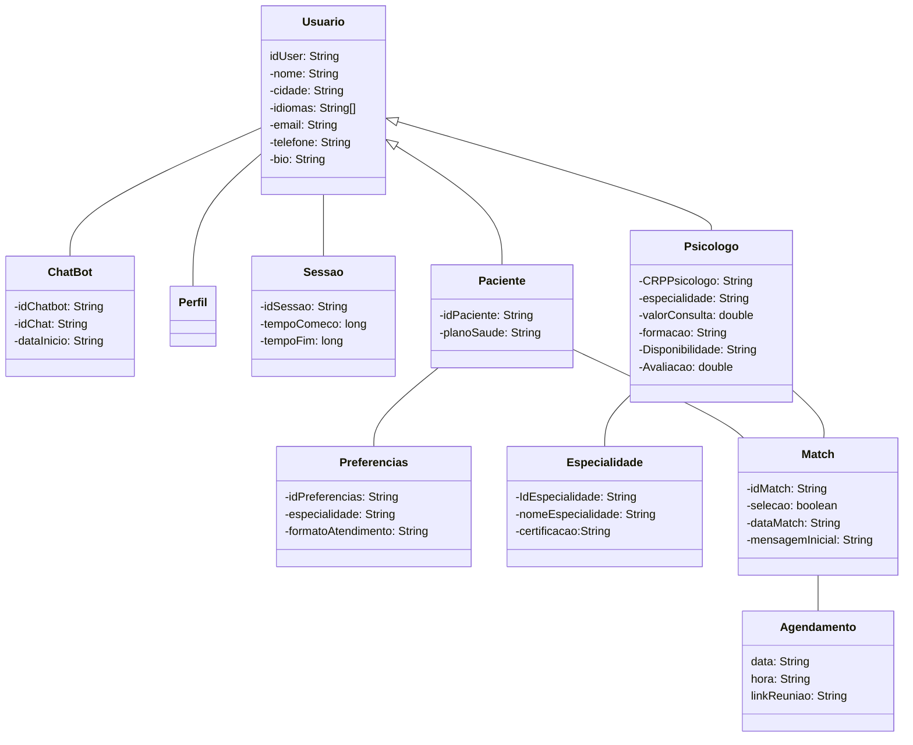

**Sistema de combinação entre psicólogos e pacientes**

## Sumário
- Integrantes;
- Descrição do Solução;
- Principais Funcionalidades
- Diagrama de Classes

> [!abstract]  Integrantes
> - Artur Lopes Fiorindo 553481 
> - Eduardo Felipe Nunes Função 553362 
> - Jhoe Yoshio Kochi Hashimoto 553831  

### Descrição da Solução

Como forma de contextualização da discussão, a seguir está descrita uma das metas do ODS 3 de acordo com a ONU:
> 3.4 até 2030, reduzir em um terço a mortalidade prematura por doenças não transmissíveis (DNTs) via prevenção e tratamento, e promover a saúde mental e o bem-estar

Esta foi    adequada para a realidade brasileira pelo [IPEA](https://www.ipea.gov.br/ods/ods3.html) da seguinte maneira:
> Até 2030, reduzir em um terço a mortalidade prematura por doenças não transmissíveis via prevenção e tratamento, promover a saúde mental e o bem-estar, a saúde do trabalhador e da trabalhadora, e prevenir o suicídio, alterando significativamente a tendência de aumento.

Dentro dessa problemática, é notável que a questão da promoção de discussões é o ato de trazer holofotes para as questões de saúde mental são de grande importância para a prosperidade social do mundo. Não é coincidência que seja um tema tratado com tanto cuidado e destaque, a nível nacional e internacional.

A solução apresentada é a de criar um sistema online que permita com que **psicólogos e pacientes se conectem** com base na combinação de necessidades e oferecimentos de um e de outro. Após a descrição do paciente a respeito do que procura e necessita dentro de uma sessão terapêutica, o sistema busca em sua base de dados os melhores psicólogos para o seu atendimento de acordo com suas especialidades e preferências, ordenando-os para a visualização dos pacientes. Nesse momento, o potencial paciente pode visualizar com mais detalhes o perfil de cada psicólogo com o qual ele pode combinar e, caso queira, pode visualizar horários livres da agenda de determinado psicólogo para que possa realizar sua primeira consulta com o seu novo *match*

Olhando o caso da Happvida, a promoção de um sistema para encontro e agendamento de psicólogos é uma nova estratégia de negócios que pode combinar profundamente com o atual mercado da empresa. É possível que, por exemplo, o sistema somente aceite profissionais que atendam pelo plano de saúde de uma das seguradoras da Happvida, trazendo novos clientes e profissionais ao ecossistema da empresa.s

### Principais Funcionalidades
- Cadastro de Usuários (diferenciando psicólogos de clientes);
- Criação de lista de potenciais psicólogos matches para cada paciente;
- Agendamento de consulta após a combinação ser bem sucedida;
- Portal explicando funcionamento do chat
- Chat entre pisicólogos e pacientes que combinaram;
- Chatbot que 
### Diagrama de Classes
Usando o framework [Mermaid.js](https://mermaid.live/) (Usado para desenvolvimento de diagramas embutidos em javascript), foi criado o diagrama de classes a seguir para a solução **Pisitin**:

